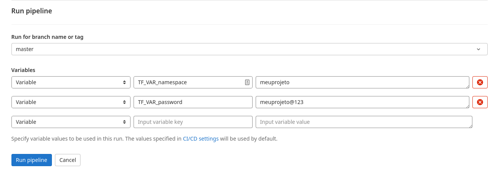
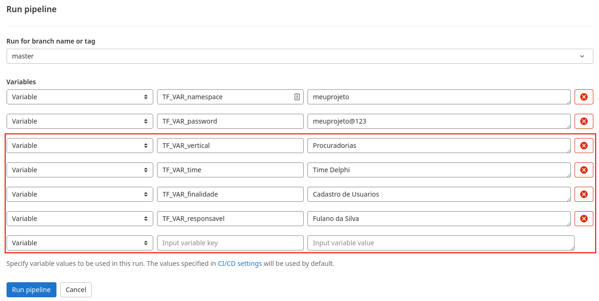

# Pipeline de criação de ambiente de desenvolvimento

Visando facilitar a criação de usuários nas namespaces do Kubernetes no ambiente de desenvolvimento, criamos esse projeto onde conseguimos automatizar
todo esse processo. Ao executar a pipeline, os seguintes recursos serão criados

- Namespace dentro do cluster interno de desenvolvimento
- Usuário deploy_user, que tem permissão total dentro da namespace criada
- Usuário no elasticsearch/kibana
- Realm no Keycloak
- Usuário e bucket no Minio
- Usuário e database no MongoDB
- Usuário e vhost no RabbitMQ

Para esse processo, foram criadas duas pipelines e unificadas através do recurso "multi-project pipelines" do gitlab, que basicamente cria um gatilho
para uma pipeline chamar a outra. Nós precisamos fazer isso, pois na primeira pipeline é criado o usuário depĺoy_user com permissão full na namespace
desejada, e os usuários das aplicações acima precisam do token desse usuário para criação, para isso nós exportamos o token para o terraform e enviamos pra segunda pipeline para que a mesma consiga utilizá-lo.

Para executar o processo de criação de ambiente, basta executar a pipeline

O valor definido em TF_VAR_namespace será o valor utilizado tanto para o nome da namespace, quanto para todos os usuários das aplicações. E o valor definido em TF_VAR_password será a senha para os usuários criados.

Além disso é possível passar algumas variáveis importantes, porém opcionais, para identificação do projeto dentro do cluster.

* **TF_VAR_vertical**    = Vertical
* **TF_VAR_time**        = Time responsável pelo projeto
* **TF_VAR_finalidade**  = Breve descrição da finalidade do projeto (ex. Apis da Pasta Digital)
* **TF_VAR_responsavel** = Colaborador responsável pelo Projeto # create_namespace_user
